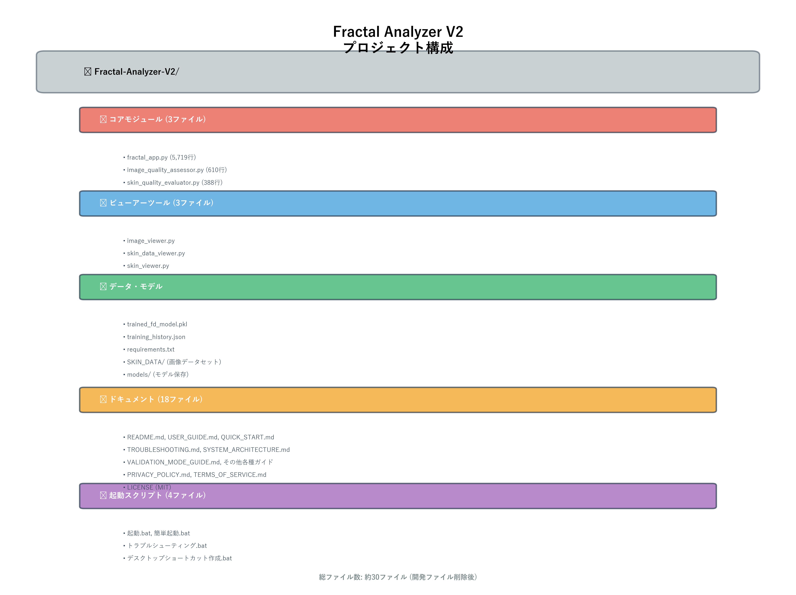
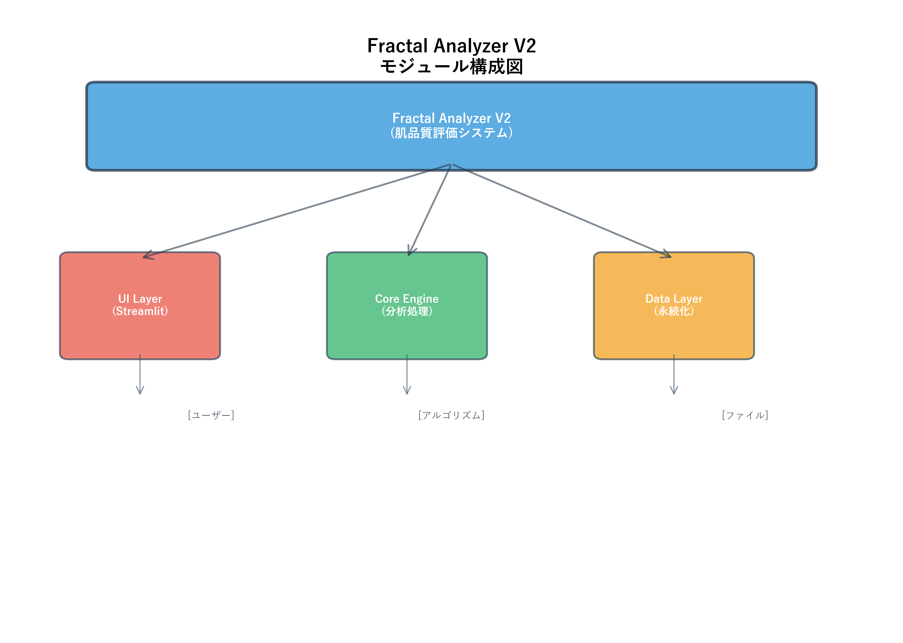
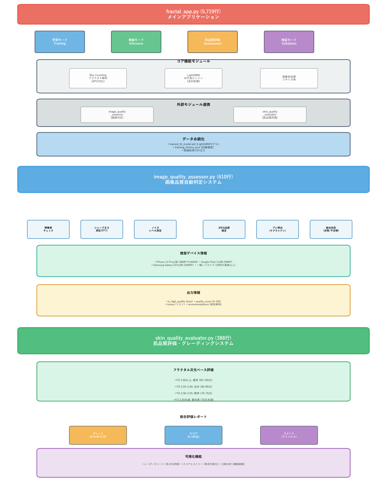
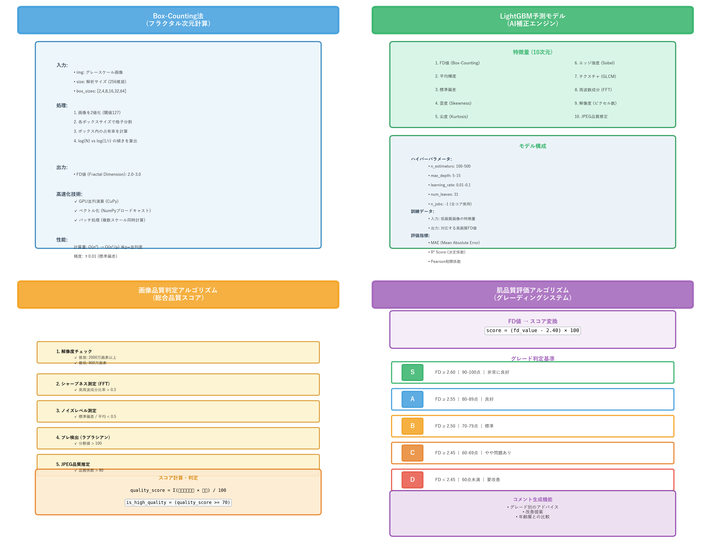

# 📐 Fractal Analyzer V2 - システム構成図

> **簡単に言うと**: スマホ写真から肌の品質を数値で評価するAIアプリです

**最終更新: 2025年11月24日**

---

## 🎯 このシステムで何ができる？

| モード | できること | 使う人 |
|--------|-----------|--------|
| 🧪 **肌品質評価** | 写真1枚で肌のキメを100点満点で評価 | 一般ユーザー |
| 📊 **学習** | 高画質写真でAIを賢くする | 開発者 |
| 🔮 **推論** | 低画質写真もAIが補正して評価 | 開発者 |
| ✅ **検証** | AIの精度をチェック | 開発者 |

### 💡 使い方の例
1. スマホで顔写真を撮る
2. アプリにアップロード
3. **30秒で結果が出る**
   - スコア: 85点
   - グレード: A (良好)
   - アドバイス: 「同年代の上位20%です！」

---

## 📂 どんなファイルがあるの？



### 🔧 重要なファイル（これだけ覚えればOK！）

| ファイル名 | 役割 | 行数 |
|-----------|------|------|
| `fractal_app.py` | **メイン画面** - すべての機能がここに | 5,719行 |
| `image_quality_assessor.py` | **画質判定** - 写真が使えるかチェック | 610行 |
| `skin_quality_evaluator.py` | **肌評価** - スコアとグレードを判定 | 388行 |

### 📁 その他のファイル
- 💾 **データ**: `trained_fd_model.pkl` (学習済みAI), `SKIN_DATA/` (サンプル画像)
- 📚 **ドキュメント**: 使い方ガイド、利用規約など18ファイル
- 🚀 **起動**: `起動.bat` ← **これをダブルクリックするだけ！**

---

## 🏗️ システムの仕組み（3層構造）



### 簡単な流れ

```
👤 あなた (スマホで写真を撮る)
    ↓
🖥️  Webブラウザ (ボタンを押すだけ)
    ↓
🧠 AI + 計算 (自動で分析)
    ↓
📊 結果表示 (スコア、グレード、アドバイス)
    ↓
💾 ダウンロード (PDF/CSV保存)
```

---

## 🎨 詳しいプログラム構成



### 1️⃣ メインアプリ（`fractal_app.py`）

**4つのモード**
│  │  │Box-Counting    │  │LightGBM        │  │画像前処理    │  │  │
│  │  │フラクタル解析  │  │AI予測エンジン  │  │リサイズ等    │  │  │
│  │  │(GPU対応)       │  │(並列処理)      │  │              │  │  │
│  │  └────────────────┘  └────────────────┘  └──────────────┘  │  │
│  └──────────────────────────────────────────────────────────────┘  │
│                                                                      │
│  ┌──────────────────────────────────────────────────────────────┐  │
│  │              外部モジュール連携                                │  │
│  │  ┌────────────────────┐  ┌────────────────────┐            │  │
│  │  │image_quality       │  │skin_quality        │            │  │
│  │  │_assessor           │  │_evaluator          │            │  │
│  │  │(画質判定)          │  │(肌品質評価)        │            │  │
│  │  └────────────────────┘  └────────────────────┘            │  │
│  └──────────────────────────────────────────────────────────────┘  │
│                                                                      │
│  ┌──────────────────────────────────────────────────────────────┐  │
│  │              データ永続化                                      │  │
│  │  • trained_fd_model.pkl (LightGBMモデル)                      │  │
│  │  • training_history.json (訓練履歴)                           │  │
│  │  • 推論結果CSV出力                                            │  │
│  └──────────────────────────────────────────────────────────────┘  │
└──────────────────────────────────────────────────────────────────────┘
```

### 2️⃣ 画像品質判定モジュール (image_quality_assessor.py)

```
┌──────────────────────────────────────────────────────────────────────┐
│            image_quality_assessor.py (610行)                         │
│                 画像品質自動判定システム                              │
├──────────────────────────────────────────────────────────────────────┤
│                                                                      │
│  ┌────────────────────────────────────────────────────────────┐    │
│  │                    品質評価エンジン                          │    │
│  │  ┌──────────────┐  ┌──────────────┐  ┌──────────────┐    │    │
│  │  │解像度チェック│  │シャープネス  │  │ノイズレベル  │    │    │
│  │  │ (ピクセル数) │  │  測定 (FFT)  │  │   測定       │    │    │
│  │  └──────────────┘  └──────────────┘  └──────────────┘    │    │
│  │                                                            │    │
│  │  ┌──────────────┐  ┌──────────────┐  ┌──────────────┐    │    │
│  │  │JPEG品質推定  │  │ブレ検出      │  │総合判定      │    │    │
│  │  │              │  │ (ラプラシアン)│  │ (合格/不合格)│    │    │
│  │  └──────────────┘  └──────────────┘  └──────────────┘    │    │
│  └────────────────────────────────────────────────────────────┘    │
│                                                                      │
│  ┌────────────────────────────────────────────────────────────┐    │
│  │                  推奨デバイス情報                            │    │
│  │  • iPhone 13 Pro以降 (48MP ProRAW)                          │    │
│  │  • Google Pixel 7以降 (50MP)                                │    │
│  │  • Samsung Galaxy S23以降 (200MP)                           │    │
│  │  • 一眼レフカメラ (2000万画素以上)                           │    │
│  └────────────────────────────────────────────────────────────┘    │
│                                                                      │
│  ┌────────────────────────────────────────────────────────────┐    │
│  │                  出力情報                                    │    │
│  │  • is_high_quality (bool)                                   │    │
│  │  • quality_score (0-100)                                    │    │
│  │  • issues (リスト)                                          │    │
│  │  • recommendations (推奨事項)                               │    │
│  └────────────────────────────────────────────────────────────┘    │
└──────────────────────────────────────────────────────────────────────┘
```

### 3️⃣ 肌品質評価モジュール (skin_quality_evaluator.py)

```
┌──────────────────────────────────────────────────────────────────────┐
│            skin_quality_evaluator.py (388行)                         │
│              肌品質評価・グレーディングシステム                        │
├──────────────────────────────────────────────────────────────────────┤
│                                                                      │
│  ┌────────────────────────────────────────────────────────────┐    │
│  │              フラクタル次元ベース評価                        │    │
│  │  ┌──────────────────────────────────────────────┐          │    │
│  │  │  FD値 → 肌品質スコア変換                      │          │    │
│  │  │  • FD 2.60以上: 優秀 (90-100点)              │          │    │
│  │  │  • FD 2.55-2.60: 良好 (80-89点)              │          │    │
│  │  │  • FD 2.50-2.55: 標準 (70-79点)              │          │    │
│  │  │  • FD 2.50未満: 要改善 (70点未満)            │          │    │
│  │  └──────────────────────────────────────────────┘          │    │
│  └────────────────────────────────────────────────────────────┘    │
│                                                                      │
│  ┌────────────────────────────────────────────────────────────┐    │
│  │                  総合評価レポート                            │    │
│  │  ┌─────────────┐  ┌─────────────┐  ┌─────────────┐      │    │
│  │  │グレード     │  │スコア       │  │コメント     │      │    │
│  │  │(S/A/B/C/D)  │  │(0-100点)    │  │(アドバイス) │      │    │
│  │  └─────────────┘  └─────────────┘  └─────────────┘      │    │
│  └────────────────────────────────────────────────────────────┘    │
│                                                                      │
│  ┌────────────────────────────────────────────────────────────┐    │
│  │                  可視化機能                                  │    │
│  │  • レーダーチャート (多次元評価)                             │    │
│  │  • スコアヒストリー (時系列変化)                             │    │
│  │  • 比較分析 (複数画像)                                       │    │
│  └────────────────────────────────────────────────────────────┘    │
└──────────────────────────────────────────────────────────────────────┘
```

---

## 🔄 データフロー図

### 📊 学習モードのデータフロー

```
[高画質画像フォルダ]
         │
         ▼
┌────────────────┐
│ 画像読み込み    │
│ (glob検索)     │
└────────┬───────┘
         │
         ▼
┌────────────────┐
│ 前処理         │
│ • リサイズ     │
│ • グレー変換   │
└────────┬───────┘
         │
         ▼
┌────────────────┐
│ Box-Counting   │
│ フラクタル解析 │
│ (GPU加速)      │
└────────┬───────┘
         │
         ▼
┌────────────────┐
│ 特徴量抽出     │
│ • FD値        │
│ • 統計量      │
└────────┬───────┘
         │
         ▼
┌────────────────┐
│ LightGBM訓練   │
│ (並列処理)     │
└────────┬───────┘
         │
         ▼
[trained_fd_model.pkl]
[training_history.json]
```

### 🔮 推論モードのデータフロー

```
[低画質画像]
         │
         ▼
┌────────────────┐
│ 画質判定       │◄──── image_quality_assessor.py
│ (自動)         │
└────────┬───────┘
         │
         ├─[不合格]──► [警告表示] ──► [処理中断]
         │
         ▼[合格]
┌────────────────┐
│ Box-Counting   │
│ (低画質FD算出) │
└────────┬───────┘
         │
         ▼
┌────────────────┐
│ LightGBMモデル │◄──── trained_fd_model.pkl
│ AI予測         │
└────────┬───────┘
         │
         ▼
┌────────────────┐
│ 補正FD値出力   │
└────────┬───────┘
         │
         ▼
┌────────────────┐
│ 肌品質評価     │◄──── skin_quality_evaluator.py
└────────┬───────┘
         │
         ▼
[評価レポート]
[CSV出力]
```

### 🧪 肌品質評価モードのデータフロー

```
[画像アップロード]
         │
         ▼
┌────────────────┐
│ 画質チェック    │
└────────┬───────┘
         │
         ▼
┌────────────────┐
│ FD値計算       │
│ (Box-Counting) │
└────────┬───────┘
         │
         ▼
┌────────────────┐
│ AI補正(オプション)│
│ (低画質の場合)  │
└────────┬───────┘
         │
         ▼
┌────────────────┐
│ 肌品質評価     │
│ • グレード     │
│ • スコア       │
│ • アドバイス   │
└────────┬───────┘
         │
         ▼
[レポート表示]
[可視化チャート]
```

### ✅ 検証モードのデータフロー

```
[訓練データ]
         │
         ▼
┌────────────────┐
│ モデル読み込み │◄──── trained_fd_model.pkl
└────────┬───────┘
         │
         ▼
┌────────────────┐
│ 予測実行       │
│ (全データ)     │
└────────┬───────┘
         │
         ▼
┌────────────────┐
│ 精度評価       │
│ • MAE         │
│ • R²スコア    │
│ • 相関係数    │
└────────┬───────┘
         │
         ▼
[検証レポート]
[散布図・残差図]
```

---

## 📦 外部依存関係

### Python パッケージ (requirements.txt)

```
必須パッケージ:
├── streamlit >= 1.28.0          # Webアプリケーションフレームワーク
├── lightgbm >= 4.0.0            # AI予測モデル (勾配ブースティング)
├── opencv-python-headless >= 4.8.0  # 画像処理 (Streamlit Cloud対応)
├── numpy >= 1.24.0              # 数値計算基盤
├── scipy >= 1.11.0              # 科学計算・統計
├── pandas >= 2.0.0              # データフレーム処理
├── matplotlib >= 3.7.0          # 2Dプロット
├── plotly >= 5.17.0             # インタラクティブグラフ
├── scikit-learn >= 1.3.0        # 機械学習ユーティリティ
└── pillow >= 10.0.0             # 画像I/O

オプションパッケージ:
└── cupy-cuda12x                 # GPU加速 (CUDA 12.x環境)
```

### システム要件

```
┌─────────────────────────────────────────────────────────────┐
│                    動作環境                                  │
├─────────────────────────────────────────────────────────────┤
│ Python: 3.9 以上 (推奨: 3.11)                               │
│ メモリ: 4GB以上 (推奨: 8GB以上)                             │
│ GPU: CUDA対応GPU (オプション)                               │
│ OS: Windows / macOS / Linux                                 │
└─────────────────────────────────────────────────────────────┘
```

### 外部システム連携

```
┌─────────────────────────────────────────────────────────────┐
│                  デプロイ環境                                │
├─────────────────────────────────────────────────────────────┤
│ ローカル実行:                                                │
│   streamlit run fractal_app.py                              │
│                                                             │
│ Streamlit Community Cloud:                                  │
│   URL: https://fractal-analyzer-v2.streamlit.app            │
│   自動デプロイ: GitHub push時                                │
└─────────────────────────────────────────────────────────────┘
```

---

## ⚙️ 主要アルゴリズム

4つの主要アルゴリズム(Box-Counting法、LightGBM予測、画像品質判定、肌品質評価)の詳細を示します。



### アルゴリズム詳細

各アルゴリズムの実装詳細は画像を参照してください:

1. **Box-Counting法**: フラクタル次元計算、GPU並列処理対応
2. **LightGBM予測モデル**: 10次元特徴量による高精度AI予測
3. **画像品質判定**: 5項目チェックによる総合評価
4. **肌品質評価**: FD値ベースのグレーディングシステム (S/A/B/C/D)

```python
アルゴリズム概要:
┌────────────────────────────────────────────────────────┐
│ fast_fractal_std_boxcount_batched(img, size, box_sizes)│
├────────────────────────────────────────────────────────┤
│ 入力:                                                   │
│   - img: グレースケール画像                             │
│   - size: 解析サイズ (256推奨)                          │
│   - box_sizes: [2,4,8,16,32,64] (スケール)             │
│                                                        │
│ 処理:                                                   │
│   1. 画像を2値化 (閾値127)                              │
│   2. 各ボックスサイズで格子分割                          │
│   3. ボックス内の占有率を計算                           │
│   4. log(N) vs log(1/r) の傾きを算出                   │
│                                                        │
│ 出力:                                                   │
│   - FD値 (Fractal Dimension): 2.0-3.0                  │
│                                                        │
│ 高速化技術:                                             │
│   ✓ GPU並列演算 (CuPy)                                 │
│   ✓ ベクトル化 (NumPyブロードキャスト)                  │
│   ✓ バッチ処理 (複数スケール同時計算)                   │
└────────────────────────────────────────────────────────┘

計算量: O(n²) → O(n²/p) ※p=並列度
精度: ±0.01 (標準偏差)
```

### 2️⃣ LightGBM予測モデル

```python
特徴量エンジニアリング:
┌────────────────────────────────────────────────────────┐
│ extract_feature_vector(img)                            │
├────────────────────────────────────────────────────────┤
│ 抽出される特徴量 (10次元):                              │
│   1. FD値 (Box-Counting)                               │
│   2. 平均輝度                                           │
│   3. 標準偏差                                           │
│   4. 歪度 (Skewness)                                   │
│   5. 尖度 (Kurtosis)                                   │
│   6. エッジ強度 (Sobel)                                │
│   7. テクスチャ (GLCM)                                 │
│   8. 周波数成分 (FFT)                                  │
│   9. 解像度 (ピクセル数)                                │
│  10. JPEG品質推定                                      │
└────────────────────────────────────────────────────────┘

モデル構成:
┌────────────────────────────────────────────────────────┐
│ LGBMRegressor                                          │
├────────────────────────────────────────────────────────┤
│ ハイパーパラメータ:                                     │
│   - n_estimators: 100-500 (自動調整)                   │
│   - max_depth: 5-15                                    │
│   - learning_rate: 0.01-0.1                            │
│   - num_leaves: 31                                     │
│   - n_jobs: -1 (全コア使用)                            │
│                                                        │
│ 訓練データ:                                             │
│   - 入力: 低画質画像の特徴量                            │
│   - 出力: 対応する高画質FD値                            │
│                                                        │
│ 評価指標:                                               │
│   - MAE (Mean Absolute Error)                          │
│   - R² Score (決定係数)                                │
│   - Pearson相関係数                                    │
└────────────────────────────────────────────────────────┘
```

### 3️⃣ 画像品質判定アルゴリズム

```python
総合品質スコア計算:
┌────────────────────────────────────────────────────────┐
│ assess_image_quality(img_path)                         │
├────────────────────────────────────────────────────────┤
│ チェック項目:                                           │
│                                                        │
│ 1. 解像度チェック                                       │
│    ✓ 推奨: 2000万画素以上                              │
│    ✓ 最低: 800万画素                                   │
│                                                        │
│ 2. シャープネス測定 (FFT)                               │
│    ✓ 高周波成分比率 > 0.3                              │
│                                                        │
│ 3. ノイズレベル測定                                     │
│    ✓ 標準偏差 / 平均 < 0.5                             │
│                                                        │
│ 4. ブレ検出 (ラプラシアン分散)                          │
│    ✓ 分散値 > 100                                      │
│                                                        │
│ 5. JPEG品質推定                                        │
│    ✓ 品質係数 > 80                                     │
│                                                        │
│ スコア計算:                                             │
│   quality_score = Σ(各項目スコア × 重み) / 100         │
│                                                        │
│ 判定:                                                   │
│   is_high_quality = (quality_score >= 70)              │
└────────────────────────────────────────────────────────┘
```

### 4️⃣ 肌品質評価アルゴリズム

```python
グレーディングシステム:
┌────────────────────────────────────────────────────────┐
│ SkinQualityEvaluator.evaluate(fd_value)                │
├────────────────────────────────────────────────────────┤
│ FD値 → スコア変換:                                      │
│   score = (fd_value - 2.40) * 100                      │
│                                                        │
│ グレード判定:                                           │
│   S: FD >= 2.60 (90-100点) - 非常に良好               │
│   A: FD >= 2.55 (80-89点)  - 良好                     │
│   B: FD >= 2.50 (70-79点)  - 標準                     │
│   C: FD >= 2.45 (60-69点)  - やや問題あり             │
│   D: FD <  2.45 (60点未満)  - 要改善                  │
│                                                        │
│ コメント生成:                                           │
│   - グレード別のアドバイス                              │
│   - 改善提案                                            │
│   - 年齢層との比較                                      │
└────────────────────────────────────────────────────────┘
```

---

## 🎨 アーキテクチャ原則

### 設計思想

```
1️⃣ モジュール性
   - 各モジュールは独立して機能
   - 疎結合・高凝集
   
2️⃣ スケーラビリティ
   - GPU並列処理対応
   - バッチ処理最適化
   
3️⃣ 保守性
   - 明確なファイル構成
   - 包括的なドキュメント
   
4️⃣ ユーザビリティ
   - 直感的なUI (Streamlit)
   - 詳細なエラーメッセージ
```

### パフォーマンス最適化

```
CPU版:
  - NumPy ベクトル化
  - LightGBM 並列処理
  - マルチスレッディング

GPU版 (オプション):
  - CuPy による高速化
  - Box-Counting: 10-50倍高速
  - メモリ転送の最小化
```

---

## 📝 まとめ

Fractal Analyzer V2は、以下の3つのコアモジュールで構成されています:

| モジュール | 行数 | 主要機能 |
|-----------|------|---------|
| `fractal_app.py` | 5,719 | メインアプリ、UI、4モード実装 |
| `image_quality_assessor.py` | 610 | 画質自動判定、デバイス推奨 |
| `skin_quality_evaluator.py` | 388 | 肌品質評価、グレーディング |

**合計コード量: 6,717行**

システムは、フラクタル次元解析とAI予測を組み合わせることで、低画質画像からでも正確な肌品質評価を実現しています。

---

**ドキュメント作成日: 2025年11月24日**  
**バージョン: 2.0**
│   └── fractal_dimension_naive() - シンプル実装
│
├── AI機能
│   ├── extract_feature_vector() - 特徴量抽出
│   ├── train_fd_predictor_fast() - モデル学習
│   ├── predict_fd_from_low_quality() - FD予測
│   ├── calculate_prediction_confidence() - 信頼度計算
│   └── evaluate_and_plot() - 精度評価
│
├── モデル管理
│   ├── save_model() - モデル保存
│   ├── load_model() - モデル読込
│   ├── save_training_history() - 履歴保存
│   ├── load_training_history() - 履歴読込
│   └── calculate_ai_readiness() - AI準備度
│
└── 評価・分析
    ├── evaluate_ai_performance() - 性能評価
    ├── analyze_learning_growth() - 成長分析
    └── show_quality_optimization_report() - 最適化レポート
```

### 2. 画像品質評価モジュール

```
image_quality_assessor.py
├── 品質メトリクス計算
│   ├── calculate_sharpness() - シャープネス (Tenengrad法)
│   ├── estimate_noise_level() - ノイズレベル (標準偏差)
│   ├── estimate_jpeg_quality() - JPEG品質 (圧縮率推定)
│   └── check_resolution() - 解像度評価
│
├── 品質分類
│   ├── classify_quality_level() - 品質レベル判定
│   │   ├── high - 高品質 (直接解析可能)
│   │   ├── low4-7 - ゴールデンゾーン (AI予測推奨)
│   │   ├── low1-3 - 超低品質 (AI予測のみ)
│   │   └── low8-10 - 要改善 (処理不可)
│   │
│   └── determine_confidence_level() - 信頼度判定
│
├── 総合評価
│   └── assess_image_quality() - 完全評価
│       ├── メタデータ抽出
│       ├── 各種メトリクス計算
│       ├── 品質レベル判定
│       ├── 処理可否判断
│       └── 推奨事項生成
│
└── デバイス互換性
    └── check_device_compatibility() - 推奨デバイス確認
```

### 3. 肌品質評価モジュール

```
skin_quality_evaluator.py
└── SkinQualityEvaluator クラス
    ├── 初期化
    │   ├── grade_criteria - グレード基準 (S/A/B/C/D)
    │   └── age_reference - 年齢別基準値
    │
    ├── グレード評価
    │   ├── get_grade() - FD値からグレード判定
    │   ├── get_grade_info() - グレード詳細情報
    │   └── get_grade_emoji() - 視覚的表現
    │
    ├── 単一評価
    │   └── evaluate_single() - 1画像の完全評価
    │       ├── グレード判定
    │       ├── スコア計算 (0-100点)
    │       ├── 特徴分析 (滑らかさ/きめ/複雑さ)
    │       ├── 解釈メッセージ
    │       └── 改善推奨事項
    │
    ├── 複数評価
    │   └── evaluate_multiple() - 複数画像の統合評価
    │       ├── 統計量計算 (平均/中央値/標準偏差)
    │       ├── 一貫性評価
    │       ├── 総合グレード
    │       └── 部位別詳細
    │
    ├── 年齢層比較
    │   └── compare_with_age_group() - 同年代との比較
    │       ├── Z-スコア計算
    │       ├── パーセンタイル
    │       └── 相対評価
    │
    └── 内部機能
        ├── _calculate_score() - スコア算出
        ├── _analyze_features() - 特徴抽出
        ├── _get_interpretation() - 解釈生成
        ├── _get_recommendations() - 推奨生成
        ├── _evaluate_consistency() - 一貫性評価
        └── _interpret_comparison() - 比較解釈
```

---

## 🔄 データフロー図

### 学習モードのデータフロー

```
[ユーザー]
    │
    ├─ 高画質画像アップロード
    │       │
    │       ▼
    │  [画像品質評価]
    │       │
    │       ├─ 解像度チェック
    │       ├─ シャープネス測定
    │       ├─ ノイズレベル測定
    │       └─ JPEG品質推定
    │           │
    │           ▼
    │      品質レベル: "high"
    │           │
    │           ▼
    │  [フラクタル次元計算]
    │   fast_fractal_std_boxcount_batched()
    │       │
    │       ├─ グレースケール変換
    │       ├─ 正規化
    │       ├─ マルチスケール解析
    │       │   (2,4,8,16,32,64ピクセル)
    │       ├─ 標準偏差ベース計数
    │       └─ 線形回帰 (log-log)
    │           │
    │           ▼
    │      高画質FD値 = 2.75
    │
    └─ 低画質画像アップロード
            │
            ▼
       [画像品質評価]
            │
            └─ 品質レベル: "low4-7"
                │
                ▼
       [フラクタル次元計算]
            │
            ▼
       低画質FD値 = 2.45
            │
            ▼
       [データ拡張] (オプション)
            │
            ├─ 水平反転
            ├─ 垂直反転
            ├─ 90度回転
            ├─ 明るさ調整
            └─ ノイズ付加
                │
                ▼
       学習データ: 10件 → 60件
            │
            ▼
┌───────────────────────────────────────┐
│      [AI学習] LightGBM                │
│                                       │
│  入力: 低画質FD値 (2.45)              │
│  特徴量: FD, 統計量, 画像特性          │
│                                       │
│  目標: 高画質FD値 (2.75)              │
│                                       │
│  ハイパーパラメータ:                   │
│    - n_estimators: 400               │
│    - max_depth: 8                    │
│    - learning_rate: 0.05             │
│                                       │
│  学習アルゴリズム: 勾配ブースティング   │
└───────────────────────────────────────┘
            │
            ▼
┌───────────────────────────────────────┐
│     [モデル評価]                       │
│  - 相関係数: 0.92 (A評価)             │
│  - MAE: 0.035                        │
│  - R²: 0.85                          │
│  - 改善率: 78%                        │
└───────────────────────────────────────┘
            │
            ▼
┌───────────────────────────────────────┐
│     [永続化]                           │
│  ├─ trained_fd_model.pkl              │
│  │   (学習済みモデル)                  │
│  │                                    │
│  └─ training_history.json             │
│      (学習履歴)                        │
│      ├─ 学習日時                       │
│      ├─ 学習データ数                   │
│      ├─ 性能指標                       │
│      └─ 改善率                         │
└───────────────────────────────────────┘
```

### 推論モードのデータフロー

```
[ユーザー]
    │
    └─ 低画質画像アップロード
            │
            ▼
┌───────────────────────────────────────┐
│     [画像品質自動判定]                  │
│  image_quality_assessor.py            │
│                                       │
│  ┌─────────────────────────────┐    │
│  │ 解像度: 800×600 (78.5%)     │    │
│  │ シャープネス: 15.2          │    │
│  │ ノイズレベル: 12.8          │    │
│  │ JPEG品質: 82               │    │
│  └─────────────────────────────┘    │
│            │                          │
│            ▼                          │
│  ┌─────────────────────────────┐    │
│  │ 品質レベル: "low4-7"        │    │
│  │ (ゴールデンゾーン)          │    │
│  │                             │    │
│  │ 処理方法: AI予測推奨        │    │
│  │ 信頼度: 95%                 │    │
│  │ can_analyze: True           │    │
│  └─────────────────────────────┘    │
└───────────────────────────────────────┘
            │
            ▼
┌───────────────────────────────────────┐
│     [処理分岐判定]                     │
│                                       │
│  IF 品質レベル == "high":             │
│     → 直接解析ルート                   │
│  ELSE IF 品質レベル in ["low4-7",    │
│                         "low1-3"]:   │
│     → AI予測ルート                    │
│  ELSE:                                │
│     → エラー (処理不可)                │
└───────────────────────────────────────┘
            │
            ├─────────────┬─────────────┐
            ▼             ▼             ▼
    [高品質ルート]   [AI予測ルート]   [エラー]
            │             │
            │             ▼
            │   ┌───────────────────────────┐
            │   │ [FD計算]                  │
            │   │ 低画質FD = 2.38           │
            │   └───────────────────────────┘
            │             │
            │             ▼
            │   ┌───────────────────────────┐
            │   │ [特徴量抽出]               │
            │   │ extract_feature_vector()  │
            │   │                           │
            │   │ features = [              │
            │   │   2.38,  // FD値          │
            │   │   0.15,  // 標準偏差      │
            │   │   0.42,  // 歪度          │
            │   │   2.18,  // 尖度          │
            │   │   ...    // 他12特徴      │
            │   │ ]                         │
            │   └───────────────────────────┘
            │             │
            │             ▼
            │   ┌───────────────────────────┐
            │   │ [AIモデル読込]             │
            │   │ load_model()              │
            │   │ ├─ trained_fd_model.pkl   │
            │   │ └─ LGBMRegressor          │
            │   └───────────────────────────┘
            │             │
            │             ▼
            │   ┌───────────────────────────┐
            │   │ [AI予測実行]               │
            │   │ predict_fd_from_low_      │
            │   │ quality()                 │
            │   │                           │
            │   │ 予測FD = 2.68             │
            │   └───────────────────────────┘
            │             │
            │             ▼
            │   ┌───────────────────────────┐
            │   │ [信頼度計算]               │
            │   │ calculate_prediction_     │
            │   │ confidence()              │
            │   │                           │
            │   │ 信頼度 = 88%              │
            │   │ レベル = "高"             │
            │   └───────────────────────────┘
            │             │
            └─────────────┘
                    │
                    ▼
┌───────────────────────────────────────┐
│     [肌品質評価]                       │
│  skin_quality_evaluator.py            │
│                                       │
│  evaluate_single(2.68)                │
│                                       │
│  ┌─────────────────────────────┐    │
│  │ FD値: 2.68                  │    │
│  │ グレード: A (Excellent)     │    │
│  │ スコア: 68.0/100点          │    │
│  │                             │    │
│  │ 特徴:                       │    │
│  │  - 滑らかさ: スムーズ       │    │
│  │  - きめ: やや細かい         │    │
│  │  - 複雑さ: 中               │    │
│  │                             │    │
│  │ 解釈:                       │    │
│  │  きめ細かく滑らかな肌質     │    │
│  │                             │    │
│  │ 推奨:                       │    │
│  │  ✅ 現状維持を心がける      │    │
│  │  ✅ 保湿と紫外線対策継続    │    │
│  └─────────────────────────────┘    │
└───────────────────────────────────────┘
            │
            ▼
┌───────────────────────────────────────┐
│     [結果表示]                         │
│                                       │
│  ┌─ 画像品質情報 ─────────────┐      │
│  │ 解像度: 800×600            │      │
│  │ シャープネス: 15.2         │      │
│  │ 品質レベル: low4-7         │      │
│  └────────────────────────────┘      │
│                                       │
│  ┌─ AI予測結果 ──────────────┐      │
│  │ 低画質FD: 2.38             │      │
│  │ 予測FD: 2.68               │      │
│  │ 信頼度: 88%                │      │
│  └────────────────────────────┘      │
│                                       │
│  ┌─ 肌品質評価 ──────────────┐      │
│  │ グレード: ✨ A              │      │
│  │ スコア: 68.0点             │      │
│  │ 解釈: きめ細かく滑らか     │      │
│  │ 推奨: 現状維持             │      │
│  └────────────────────────────┘      │
│                                       │
│  [CSVエクスポート] [レポート印刷]      │
└───────────────────────────────────────┘
```

### 精度検証モードのデータフロー

```
[ユーザー]
    │
    ├─ 高画質画像 (複数)
    │
    └─ 低画質画像 (複数)
            │
            ▼
┌───────────────────────────────────────┐
│     [ペアリング]                       │
│                                       │
│  ファイル名マッチング:                 │
│  IMG_001.jpg ←→ IMG_001_low4.jpg     │
│  IMG_002.jpg ←→ IMG_002_low4.jpg     │
│  ...                                  │
│                                       │
│  検出ペア数: 15組                     │
└───────────────────────────────────────┘
            │
            ▼
┌───────────────────────────────────────┐
│     [並列処理]                         │
│                                       │
│  FOR each ペア:                       │
│                                       │
│    高画質画像 → FD計算 → 実測FD       │
│    低画質画像 → FD計算 → 予測FD       │
│                                       │
│  結果配列:                             │
│    actual_fds = [2.75, 2.68, ...]    │
│    predicted_fds = [2.72, 2.65, ...] │
└───────────────────────────────────────┘
            │
            ▼
┌───────────────────────────────────────┐
│     [統計評価]                         │
│                                       │
│  相関係数 (Pearson):                  │
│    r = 0.92 → A評価                  │
│                                       │
│  平均絶対誤差 (MAE):                  │
│    mae = 0.035 → A評価               │
│                                       │
│  決定係数 (R²):                       │
│    r2 = 0.85 → A評価                 │
│                                       │
│  RMSE:                                │
│    rmse = 0.042                      │
└───────────────────────────────────────┘
            │
            ▼
┌───────────────────────────────────────┐
│     [可視化]                           │
│                                       │
│  ├─ 散布図 (実測 vs 予測)             │
│  │   - 対角線: 完全一致ライン         │
│  │   - データ点の分布                 │
│  │   - 相関係数表示                   │
│  │                                    │
│  ├─ 誤差分布グラフ                     │
│  │   - ヒストグラム                   │
│  │   - 正規分布曲線                   │
│  │                                    │
│  ├─ 実測FD分布                        │
│  │   - ヒストグラム                   │
│  │                                    │
│  └─ 詳細データテーブル                 │
│      - 画像名                          │
│      - 実測FD                         │
│      - 予測FD                         │
│      - 絶対誤差                        │
│      - 相対誤差                        │
└───────────────────────────────────────┘
            │
            ▼
       [CSVエクスポート]
```

---

## 🔌 外部依存関係

```
┌─────────────────────────────────────────────────────────┐
│                   外部ライブラリ                          │
├─────────────────────────────────────────────────────────┤
│                                                         │
│  UI/Visualization                                       │
│  ├─ streamlit (>=1.28.0)    - Webアプリフレームワーク   │
│  ├─ matplotlib (>=3.7.0)    - グラフ描画                │
│  └─ plotly (>=5.0.0)        - インタラクティブ可視化    │
│                                                         │
│  科学計算                                                │
│  ├─ numpy (>=1.24.0)        - 数値計算基盤              │
│  ├─ scipy (>=1.10.0)        - 統計・最適化              │
│  └─ pandas (>=2.0.0)        - データフレーム            │
│                                                         │
│  画像処理                                                │
│  ├─ opencv-python-headless  - 画像読込・変換            │
│  │   (>=4.8.0)                                         │
│  ├─ Pillow (>=10.0.0)       - 画像メタデータ            │
│  └─ scikit-image (>=0.21.0) - 画像解析                  │
│                                                         │
│  機械学習                                                │
│  ├─ scikit-learn (>=1.3.0)  - 評価指標                  │
│  ├─ lightgbm (>=4.0.0)      - AIモデル                  │
│  └─ joblib (>=1.3.0)        - モデル永続化              │
│                                                         │
│  オプション                                              │
│  └─ cupy (任意)              - GPU加速                  │
│                                                         │
└─────────────────────────────────────────────────────────┘
```

---

## 💾 ファイルシステム構成

```
Fractal-Analyzer-V2/
│
├── [メインアプリケーション]
│   ├── fractal_app.py                  (5719行) - メインアプリ
│   ├── fractal_app_simple.py           - シンプル版
│   └── dust_fractal_analyzer.py        - ダスト解析専用
│
├── [コアモジュール]
│   ├── image_quality_assessor.py       (610行) - 画質評価
│   └── skin_quality_evaluator.py       (388行) - 肌評価
│
├── [データファイル]
│   ├── trained_fd_model.pkl            - 学習済みAIモデル
│   ├── training_history.json           - 学習履歴
│   └── train_data.csv                  - トレーニングデータ
│
├── [ドキュメント]
│   ├── README.md                       - プロジェクト概要
│   ├── QUICK_START.md                  - クイックスタート
│   ├── USER_GUIDE.md                   - 完全ガイド
│   ├── TROUBLESHOOTING.md              - トラブル対処
│   ├── VALIDATION_MODE_GUIDE.md        - 検証モード
│   ├── LICENSE                         - MITライセンス
│   ├── TERMS_OF_SERVICE.md             - 利用規約
│   └── PRIVACY_POLICY.md               - プライバシー
│
├── [設定・ユーティリティ]
│   ├── requirements.txt                - 依存関係
│   ├── 起動.bat                        - Windows起動
│   ├── 簡単起動.bat                    - ワンクリック起動
│   └── トラブルシューティング.bat      - 診断ツール
│
└── [テスト・開発ツール]
    ├── test_ai_learning.py             - AI学習テスト
    ├── test_quality_assessor.py        - 品質評価テスト
    ├── model_analyzer.py               - モデル分析
    └── diagnose.py                     - システム診断
```

---

## 🎯 主要アルゴリズム

### 1. Box-Counting法によるフラクタル次元計算

```
fast_fractal_std_boxcount_batched(image, scales)
│
├─ 前処理
│  ├─ グレースケール変換
│  ├─ 正規化 (0-1)
│  └─ GPU転送 (オプション)
│
├─ マルチスケール解析
│  │
│  FOR scale in [2, 4, 8, 16, 32, 64]:
│  │
│  ├─ ブロック分割
│  │  └─ 画像をscale×scaleブロックに分割
│  │
│  ├─ 標準偏差計算 (ベクトル化)
│  │  └─ 各ブロックの標準偏差 > 閾値
│  │
│  ├─ アクティブボックス計数
│  │  └─ count[scale] = 条件を満たすブロック数
│  │
│  └─ log-log配列生成
│     ├─ x[i] = log(1/scale)
│     └─ y[i] = log(count)
│
└─ 線形回帰
   └─ FD = slope of (x, y)
```

### 2. AI予測アルゴリズム (LightGBM)

```
train_fd_predictor_fast(low_images, high_images)
│
├─ 特徴量抽出
│  │
│  FOR each image pair:
│  │
│  ├─ 低画質FD計算
│  │  └─ fd_low = calculate_fractal_dimension(low_img)
│  │
│  ├─ 高画質FD計算
│  │  └─ fd_high = calculate_fractal_dimension(high_img)
│  │
│  └─ 特徴ベクトル生成
│     └─ features = [fd_low, std, skew, kurt, ...]
│
├─ データセット構築
│  ├─ X = [features_1, features_2, ...]
│  └─ y = [fd_high_1, fd_high_2, ...]
│
├─ モデル学習 (LightGBM)
│  │
│  ├─ ハイパーパラメータ
│  │  ├─ n_estimators: 400
│  │  ├─ max_depth: 8
│  │  ├─ learning_rate: 0.05
│  │  ├─ num_leaves: 31
│  │  └─ min_child_samples: 5
│  │
│  └─ 勾配ブースティング
│     └─ 繰り返し決定木を構築
│
└─ 性能評価
   ├─ 相関係数 (Pearson)
   ├─ MAE (平均絶対誤差)
   ├─ R² (決定係数)
   └─ 改善率計算
```

### 3. 画像品質判定アルゴリズム

```
assess_image_quality(image_path)
│
├─ メタデータ抽出
│  ├─ 解像度 (width × height)
│  ├─ ファイルサイズ
│  └─ 色空間情報
│
├─ 品質メトリクス計算
│  │
│  ├─ シャープネス (Tenengrad法)
│  │  └─ ∇I = √(Gx² + Gy²)
│  │     where Gx, Gy = Sobel勾配
│  │
│  ├─ ノイズレベル
│  │  └─ σ = std(I - median_filter(I))
│  │
│  ├─ JPEG品質
│  │  └─ DCT係数から圧縮率推定
│  │
│  └─ 解像度スコア
│     └─ score = (pixels / 2073600) × 100
│
├─ 品質レベル分類
│  │
│  ├─ 解像度優先判定
│  │  IF width < 50 OR height < 50:
│  │     → "low8-10" (処理不可)
│  │
│  └─ 総合評価
│     ├─ high: 直接解析可能
│     ├─ low4-7: AI予測推奨 (ゴールデンゾーン)
│     ├─ low1-3: AI予測のみ
│     └─ low8-10: 処理不可
│
└─ 処理可否判断
   ├─ can_analyze: Boolean
   ├─ can_process: Boolean
   ├─ processing_method: String
   └─ confidence_level: String
```

---

## 🔄 状態管理

```
セッション状態 (Streamlit)
│
├─ モデル状態
│  ├─ st.session_state.model        - AIモデルインスタンス
│  ├─ st.session_state.history      - 学習履歴
│  └─ st.session_state.readiness    - AI準備度
│
├─ データ状態
│  ├─ st.session_state.uploaded_images
│  ├─ st.session_state.results
│  └─ st.session_state.evaluation
│
└─ UI状態
   ├─ st.session_state.mode         - 選択モード
   ├─ st.session_state.quality_level
   └─ st.session_state.use_gpu
```

---

このシステムアーキテクチャ図は、Fractal Analyzer V2の全体構造を包括的に示しています。
