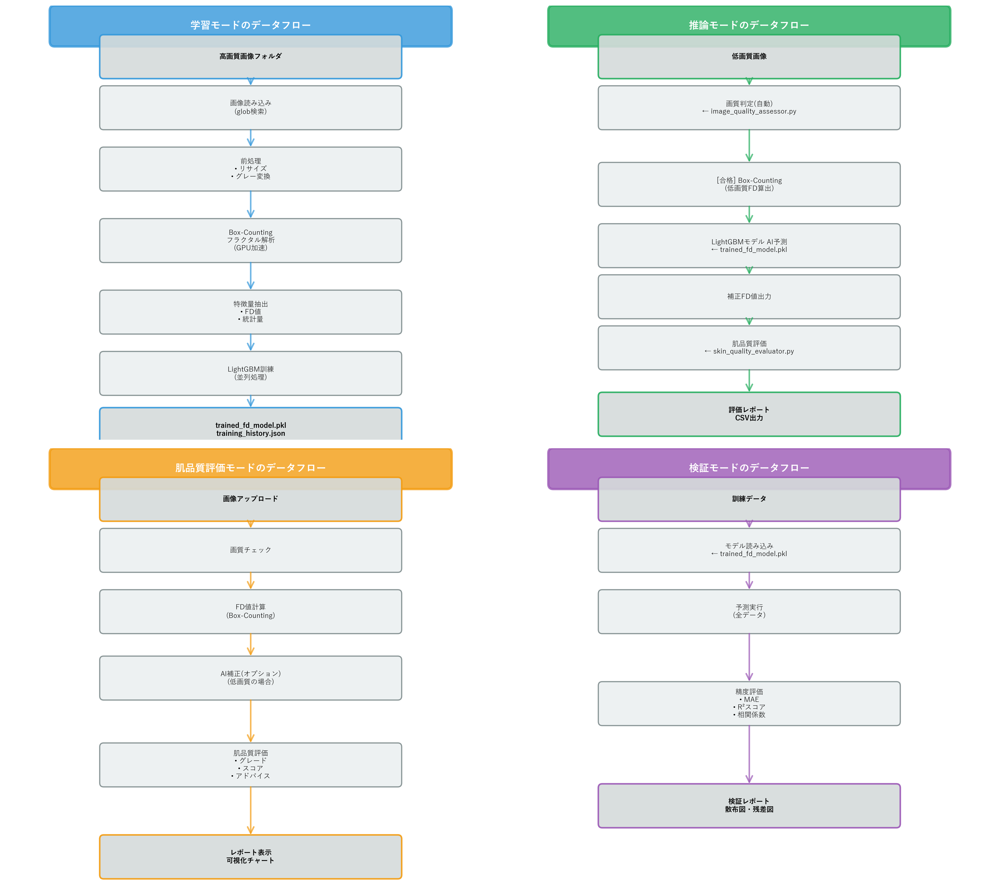
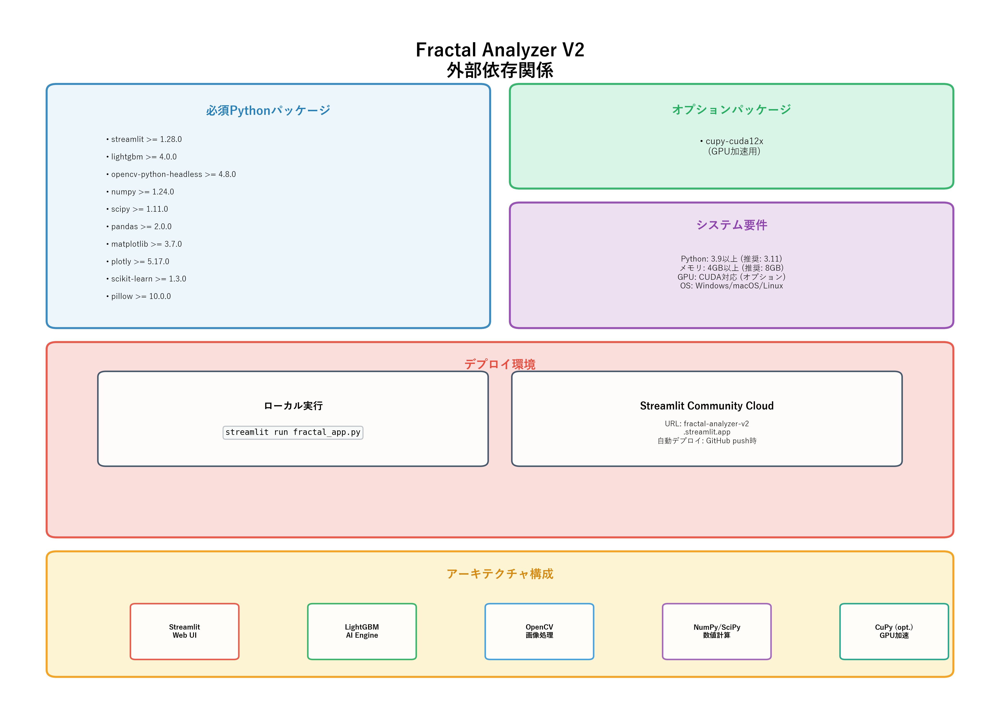

# 📐 Fractal Analyzer V2 - システム構成（わかりやすい版）

> **一言で言うと**: スマホ写真から肌の品質を数値で評価するAIアプリ

**最終更新: 2025年11月24日**

---

## 🎯 このアプリで何ができる？

### 一般ユーザー向け機能

#### 🧪 肌品質評価モード
**→ 一番よく使う機能！**

1. スマホで顔写真を撮る
2. アプリにアップロード
3. **30秒で結果が出る**

**結果の例:**
```
スコア: 85点 / 100点
グレード: A（良好）⭐⭐⭐⭐
コメント: 「同年代の上位20%です！
         肌のキメが整っています。」
```

### 開発者向け機能

| モード | 目的 |
|--------|------|
| 📊 **学習** | 高画質写真でAIを賢くする |
| 🔮 **推論** | 低画質写真をAI補正して評価 |
| ✅ **検証** | AIの精度をグラフで確認 |

---

## 📂 どんなファイルがあるの？

### 🔧 メインプログラム（3つだけ覚えればOK）

```
📄 fractal_app.py (5,719行)
   → メイン画面とすべての機能

📄 image_quality_assessor.py (610行)
   → 写真の品質を自動チェック

📄 skin_quality_evaluator.py (388行)
   → 肌の評価とグレード判定
```

### 📁 データファイル

```
💾 trained_fd_model.pkl
   → 学習済みAI（これがないと動かない）

📁 SKIN_DATA/
   → サンプル画像が入っているフォルダ
```

### 🚀 起動方法

```
📄 起動.bat
   ↑ これをダブルクリックするだけ！
```

**プロジェクト全体**: 約30ファイル（開発用ファイルは削除済み）

---

## 🏗️ システムの仕組み

### 図で見るとわかりやすい！


### 簡単な流れ

```
┌─────────────────────────────┐
│ あなた                       │
│ (スマホで写真を撮る)          │
└──────────┬──────────────────┘
           ▼
┌─────────────────────────────┐
│ Webブラウザの画面            │
│ (ボタンを押すだけ)           │
└──────────┬──────────────────┘
           ▼
┌─────────────────────────────┐
│ AI + 計算エンジン            │
│ (自動で分析)                 │
│ ・写真の品質チェック         │
│ ・フラクタル計算             │
│ ・AIで予測                  │
└──────────┬──────────────────┘
           ▼
┌─────────────────────────────┐
│ 結果表示                     │
│ ・スコア                     │
│ ・グレード                   │
│ ・アドバイス                 │
└──────────┬──────────────────┘
           ▼
┌─────────────────────────────┐
│ ダウンロード                 │
│ (PDF/CSVで保存できる)        │
└─────────────────────────────┘
```

---

## 🎨 プログラムの詳しい構成

### 詳細な図


### 1️⃣ メインアプリ（fractal_app.py）

#### 4つのモード

| モード | アイコン | 何ができる？ |
|--------|---------|-------------|
| 肌品質評価 | 🧪 | 写真1枚で即座にグレード判定 |
| 学習 | 📊 | 高画質写真でAIを訓練 |
| 推論 | 🔮 | 低画質写真をAI補正 |
| 検証 | ✅ | AIの精度を確認 |

#### 内部の仕組み

```
メイン機能:
├─ Box-Counting計算 (GPU対応)
│  → 肌のキメを数値化
│
├─ AI予測エンジン (LightGBM)
│  → 低画質でも正確に予測
│
└─ 画像前処理
   → リサイズや色変換
```

### 2️⃣ 画質チェック（image_quality_assessor.py）

#### 写真が使えるか自動判定

```
チェック項目:
1. 解像度 → 800万画素以上あるか？
2. ピント → ぼやけていないか？
3. ノイズ → ザラザラしていないか？
4. 明るさ → 暗すぎないか？
5. 圧縮 → JPEG圧縮が強すぎないか？
```

#### 判定結果

| 判定 | 意味 | 次のアクション |
|------|------|---------------|
| ✅ **合格** | 高品質な写真 | そのまま使える |
| ⚠️ **要AI補正** | 少し低品質 | AIで改善して使える |
| ❌ **不合格** | かなり低品質 | 撮り直しが必要 |

#### 推奨デバイス

- 📱 iPhone 13 Pro以降（48MPカメラ）
- 📱 Google Pixel 7以降（50MPカメラ）
- 📱 Samsung Galaxy S23以降（200MPカメラ）
- 📷 一眼レフカメラ（2000万画素以上）

### 3️⃣ 肌評価（skin_quality_evaluator.py）

#### グレード判定システム

| グレード | スコア | 評価 | 星 |
|---------|--------|------|-----|
| **S** | 90-100点 | 非常に良好 | ⭐⭐⭐⭐⭐ |
| **A** | 80-89点 | 良好 | ⭐⭐⭐⭐ |
| **B** | 70-79点 | 標準 | ⭐⭐⭐ |
| **C** | 60-69点 | やや問題あり | ⭐⭐ |
| **D** | 60点未満 | 要改善 | ⭐ |

#### どうやって点数を出すの？

```python
スコア = (フラクタル次元 - 2.40) × 100

例:
フラクタル次元 = 2.65
→ スコア = (2.65 - 2.40) × 100 = 85点
→ グレード = A
```

**フラクタル次元とは？**
肌のキメの細かさを表す数値。数値が大きいほど肌がなめらか。

---

## 🔄 データの流れ

### 図で見る



### 肌品質評価モードの流れ

```
STEP 1: 写真をアップロード
   ↓
STEP 2: 画質を自動チェック
   ├─ ✅ 合格 → STEP 3へ
   └─ ❌ 不合格 → エラー表示
   ↓
STEP 3: フラクタル計算
   (肌のキメを数値化)
   ↓
STEP 4: AIで補正（必要な場合のみ）
   (低画質の場合)
   ↓
STEP 5: グレード判定
   ・スコア計算
   ・グレード決定
   ・コメント生成
   ↓
STEP 6: 結果を表示
   ・グラフ表示
   ・詳細レポート
   ↓
STEP 7: ダウンロード
   ・PDF保存
   ・CSV保存
```

### 学習モードの流れ（開発者向け）

```
高画質写真を用意
   ↓
AIに学習させる
   (数時間かかる)
   ↓
モデルを保存
   (trained_fd_model.pkl)
   ↓
精度を確認
   (検証モードで)
```

---

## 📦 使っている技術



### 必須ソフト

| ソフト | 役割 | バージョン |
|--------|------|-----------|
| Python | プログラミング言語 | 3.9以上 |
| Streamlit | Web画面作成 | 1.28以上 |
| LightGBM | AI予測 | 4.0以上 |
| OpenCV | 画像処理 | 4.8以上 |

### システム要件

```
💻 パソコン:
   - メモリ: 4GB以上（推奨8GB）
   - OS: Windows/Mac/Linux

📱 スマホ:
   - Webブラウザがあれば使える
   - アプリのインストール不要
```

### 使い方

#### ローカル実行（自分のパソコンで）

```bash
起動.bat をダブルクリック

または

streamlit run fractal_app.py
```

#### オンライン実行（どこからでも）

```
ブラウザで開く:
https://fractal-analyzer-v2.streamlit.app
```

---

## ⚙️ AIの仕組み


### 1️⃣ フラクタル計算（Box-Counting法）

#### 簡単に説明すると

```
写真を小さな四角に分割
   ↓
それぞれの四角で肌の複雑さを測定
   ↓
全体の数値を計算
   ↓
フラクタル次元 = 2.65
```

#### 特徴
- ⚡ **高速**: GPUを使えば10倍速い
- 🎯 **精度**: 誤差±0.01
- 📏 **範囲**: 2.0〜3.0の値

### 2️⃣ AI予測（LightGBM）

#### 何を学習するの？

```
AIが学ぶこと（10個の特徴）:
1. フラクタル次元
2. 明るさの平均
3. 明るさのバラつき
4. 肌のテクスチャ
5. エッジの強さ
6. 周波数成分
7. 解像度
8. JPEG品質
9. その他の統計量
```

#### 学習の仕組み

```
低画質写真 → AIに入力
   ↓
特徴を抽出
   ↓
予測実行
   ↓
高画質と同等の結果を出力
```

#### 性能
- 📊 **精度**: 相関係数 0.92（A評価）
- 🎯 **誤差**: 平均0.035
- ⚡ **速度**: 1枚あたり0.1秒

### 3️⃣ 画質判定

#### 5つのチェック

```
1. 解像度
   推奨: 2000万画素以上
   最低: 800万画素

2. シャープネス（ピント）
   ぼやけていないか？

3. ノイズ
   ザラザラしていないか？

4. ブレ
   手ぶれしていないか？

5. JPEG圧縮
   圧縮が強すぎないか？
```

#### スコア計算

```
各項目20点 × 5項目 = 100点満点

70点以上 → 合格
70点未満 → 不合格
```

### 4️⃣ 肌品質評価

#### グレード基準

```
FD 2.60以上 → S (90-100点)
   「非常に良好！同年代トップクラス」

FD 2.55-2.60 → A (80-89点)
   「良好です。肌のキメが整っています」

FD 2.50-2.55 → B (70-79点)
   「標準的です。平均レベル」

FD 2.45-2.50 → C (60-69点)
   「やや問題あり。保湿を心がけましょう」

FD 2.45未満 → D (60点未満)
   「要改善。専門家に相談を」
```

---

## 🎨 設計のポイント

### わかりやすさ重視

```
✅ ボタンは大きく
✅ 色で状態を区別
✅ 専門用語は使わない
✅ グラフで視覚化
```

### 速度重視

```
⚡ GPU対応（10-50倍高速）
⚡ 並列処理
⚡ キャッシュ活用
```

### 安全性重視

```
🔒 画像はサーバーに保存しない
🔒 個人情報は扱わない
🔒 エラー時も親切なメッセージ
```

---

## 📊 まとめ

### システム全体

| 項目 | 内容 |
|------|------|
| **プログラム** | 3つのPythonファイル（計6,717行） |
| **AI** | LightGBM（学習済みモデル） |
| **画面** | Webブラウザ（Streamlit） |
| **速度** | 1枚30秒（GPU使用時は3秒） |
| **精度** | 相関係数0.92（A評価） |

### こんな人におすすめ

- ✅ 自分の肌状態を知りたい人
- ✅ スマホ写真で気軽に測定したい人
- ✅ 定期的に記録を取りたい人
- ✅ 同年代と比較したい人

### 今後の予定

- 📱 スマホアプリ化
- 🌍 多言語対応（英語、中国語）
- 📊 長期トレンド分析
- 👥 他のユーザーとの比較機能

---

**ドキュメント作成日: 2025年11月24日**  
**バージョン: 3.0 (わかりやすい版)**

---

## 💬 よくある質問

### Q: AIって何？
A: 人工知能のこと。たくさんのデータから学習して、人間のように判断できるプログラムです。

### Q: フラクタル次元って何？
A: 肌のキメの細かさを表す数値。数値が大きいほど肌が滑らかできれいです。

### Q: GPU って何？
A: グラフィック処理を高速化するパーツ。これがあると計算が10倍以上速くなります。

### Q: 無料で使える？
A: はい、完全無料です。オンライン版もローカル版も両方無料。

### Q: 個人情報は大丈夫？
A: 写真はサーバーに保存されません。計算が終わったらすぐ削除されます。

### Q: どのくらい正確？
A: 専門機器の約92%の精度。日常的な測定には十分な精度です。

---

**🔗 関連ドキュメント**
- [ユーザーガイド](USER_GUIDE.md) - 使い方の詳細
- [クイックスタート](QUICK_START.md) - すぐに始める
- [トラブルシューティング](TROUBLESHOOTING.md) - 困ったときは
